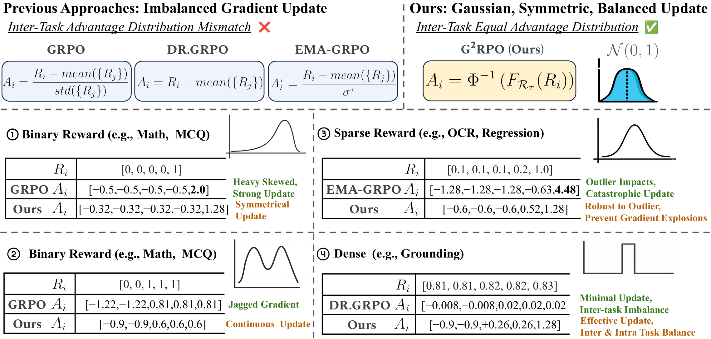
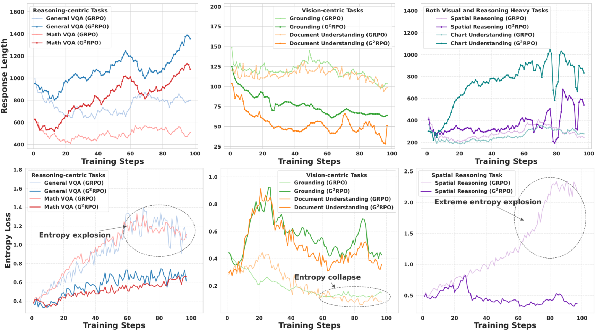
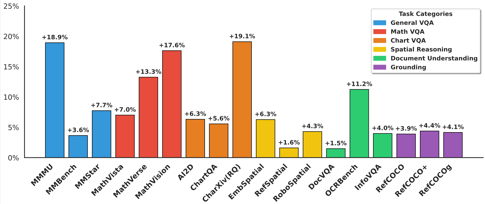

# OpenVLThinkerV2: A Generalist Multimodal Reasoning Model for Multi-domain Visual Tasks


<p align="center">
    <a href="https://gordonhu608.github.io">Wenbo Hu</a>,
    <a href="https://openreview.net/profile?id=~Xin_Chen89">Xin Chen</a>,
    <a href="https://openreview.net/profile?id=~Yan_Gao-Tian1">Yan Gao-Tian</a>,
    <a href="https://yihe-deng.notion.site/Yihe-Deng-167ab2d2c1fb80b3a76dfb120f716c84">Yihe Deng</a>,
    <a href="https://violetpeng.github.io/">Nanyun Peng</a>,
    <a href="https://web.cs.ucla.edu/~kwchang/">Kai-Wei Chang</a>
</p>


<p align="center">
  <a href="https://arxiv.org/pdf/2604.08539">📑 Paper</a>  |
  <a href="https://arxiv.org/abs/2604.08539">📖 arXiv</a>  |
  <a href="https://gordonhu608.github.io/openvlthinkerv2.github.io">🌐 Homepage</a> |
  <a href="https://huggingface.co/">🤗 Model (Coming)</a>
  <a href="https://huggingface.co/papers/2604.08539">🤗 HF Daily Paper</a>
</p>

## 🏠 About
<div style="text-align: center;">
    
</div>
    We present <b>OpenVLThinkerV2</b>, a robust, general-purpose multimodal model. 
    understanding tasks. Our model is trained with <b>G<sup>2</sup>RPO</b>, a novel RL training objective that replaces linear scaling with non-
    linear distributional matching. 
    By enforcing a Gaussian topology, <b>G<sup>2</sup>RPO</b> provides 1) intrinsic robustness to outliers, 2) symmetric updates for positive and negative rewards, and 3) uniform variance across diverse tasks.


<div style="text-align: center;">
    
</div>
We further introduce task-level response length and entropy shaping mechanisms to balance perception and multi-step reasoning. These dynamic bounds encourages early response length convergence and effectively preventing both entropy collapse and explosion.

## 🏆 Performance

Our model obtains significant performance gains after training on the baseline Qwen3-VL-Instruct-8B across diverse visual tasks. For instance, OpenVLThinkerV2 achieves $71.6\%$ on MMMU and $79.5\%$ on MathVista, surpassing GPT-4o by a significant margin. Furthermore, across six distinct benchmarks evaluating document understanding and spatial reasoning, OpenVLThinkerV2 significantly outperforms proprietary frontier models, including GPT-5 and Gemini 2.5 Pro.


<div align="center">
  
</div>


## 📢 News

- [Coming!] 📝 We will release the checkpoint of OpenVLThinkerV2 after the model trained with Cold-Start SFT. Our current results can be achieved by directly RL from Qwen3-VL-8B. Stay tuned for our stronger version! 
- [2026-04-10] 🔥 We release the example training and validation data in the [data folder](example_data).
- [2026-04-10] 🔥 We release the training and evaluation code.
- [2026-04-10] 🔥 We release the [paper](https://arxiv.org/pdf/2604.08539) of OpenVLThinkerV2.


## 📐 Set up

```bash
git clone https://github.com/uclanlp/OpenVLThinker.git
cd OpenVLThinker
conda create -n easyr1 python=3.11 
conda activate easyr1
cd EasyR1
pip install -e .
```
For more details for the RL environment installation, please refer to  [EasyR1](https://github.com/hiyouga/EasyR1).


## 🚀 Training

```bash
bash ./EasyR1/local_scripts/run_g2rpo_rl_slurm.sh
```

We provide example training and validation sample data [here](example_data). The original images in training data can be found in this [work](https://huggingface.co/datasets/OneThink/OneThinker-train-data).

Furthermore, our training process supports multi-task validation with separate scores for each task. To add more validation dataset for various tasks, please add them [here](EasyR1/local_scripts/run_g2rpo_rl_slurm.sh#L15) and update your task keys in this [file](EasyR1/verl/trainer/data_loader.py#L153).

For RL training code on AWS Trainium instances, please refer to our specific example [repo](https://github.com/YGaotian/EasyR1-Trainium).


## 🔮 Inference & Evaluation
Since OpenVLThinkerV2 shares the same architecture as Qwen3-VL-8B, it naturally supports easy and efficient inference.

We adopt [VLMEvalKit](https://github.com/open-compass/vlmevalkit) for most of our evaluation. For grounding task, we follow evaluation scripts in [OneThinker](https://github.com/tulerfeng/OneThinker/blob/main/Evaluation/Eval/eval_bench_all.sh). Please follow them for specific evaluation setups. 


## VeRL G<sup>2</sup>RPO Implementation

Please refer to the [core_algos.py](EasyR1/verl/trainer/core_algos.py#L220)

```python
@register_adv_estimator(AdvantageEstimator.GS_GRPO) 
def compute_pertask_gaussian_outcome_advantage_grpo
```

We also support our Gaussian Advantage Normalization method in GDPO, please see Gaussian (GS) GDPO: 
```python
@register_adv_estimator(AdvantageEstimator.GS_GDPO) 
def compute_pertask_gaussian_outcome_advantage_gdpo
```

These can be changed at the config [file](EasyR1/examples/config_g2rpo.yaml#L26).

## 🔗 Citation

If you find our work helpful for your research, please consider citing our work.   

```
@article{hu2026openvlthinkerv2generalistmultimodalreasoning,
      title={OpenVLThinkerV2: A Generalist Multimodal Reasoning Model for Multi-domain Visual Tasks}, 
      author={Wenbo Hu and Xin Chen and Yan Gao-Tian and Yihe Deng and Nanyun Peng and Kai-Wei Chang},
      year={2026},
      journal={arXiv preprint arXiv:2604.08539},
      url={https://arxiv.org/abs/2604.08539}, 
}
```

## 📄 License
OpenVLThinkerV2 is licensed under the Apache 2.0.


## 👏 Acknowledgements

We sincerely appreciate the contributions of the open-source community. The related projects are as follows: [EasyR1](https://github.com/hiyouga/EasyR1), [verl](https://github.com/volcengine/verl), [VLMEvalKit](https://github.com/open-compass/VLMEvalKit),  [OneThinker](https://github.com/tulerfeng/OneThinker).
